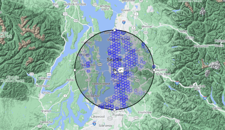
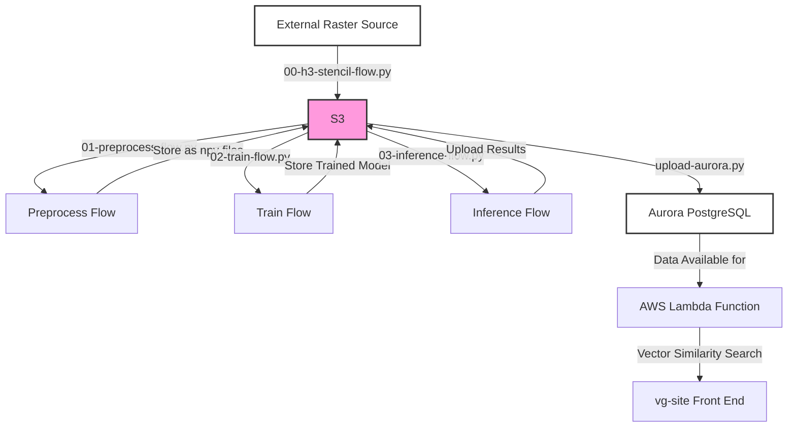

# VectorGeo
`vectorgeo` performs the data engineering, model training, and inference routines for producing a globally-available geospatial vector embedding data product for use in machine learning for Earth & environment and geographic similarity search. Broadly, the architecture is composed of several parts:

- Data cleaning, extraction, and feature engineering is conducted in Metaflow using Copernicus Land Cover data
- Model training and inference is done using Keras in MetaFlow
- Results are served from Aurora PostgreSQL, making use of the `pgvector` and PostGIS functionality unavailable in Pinecone, Weaviate, or other vector DB providers

The accompanying repository `vg-site` implements a light web viewer interfacing with the PostgreSQL database via an AWS Lambda function to help visualize the results overlaid on a map.

The end product from `vectorgeo` is a globally-available data product where each location on the Earth's surface is assigned an embedding vector useful for tasks like clustering, regression, anomaly detection, and similarity search.

You can access the web viewer for this data product at https://louisquissetlabs.com/vectorgeo.

<p align="center">
  
</p>

## Installation
Clone the repository using these commands:

```
token=$(python -c "import yaml; print(yaml.safe_load(open('secrets.yml'))['git_token'])")
git clone https://$token@github.com/ckrapu/vectorgeo.git

pip3 install pyOpenSSL --upgrade
cd vectorgeo
pip3 install -r requirements.txt
```
```

This repository was designed to run its most intensive pieces on a Lambda Labs A10 instance with 192GB of RAM and 30 cores. Individual parts of this workflow such as the preprocess and upload may work on smaller machines.


## Files & data transfer
Using this repository requires an S3 bucket (indicated in `constants.py`) to store files. Local copies are moved in and out of `tmp/` as required for each task. The module `vectorgeo/transfer.py` handles these exchanges with the correct bucket. **Note** the logic in `transfer.py` will avoid redownloading files if they can be found locally. To force a redownload, delete the relevant files manually from `tmp/`.

### Architecture
The design of this project is a basic linear progression for (0) identifying valid, non-ocean locations for modeling (1) forming a training dataset, (2) training a model, (3) applying inference to the entire world, and (4) inserting the records into a vector database for similarity search on the front end. The following diagram shows the flow of data through the system:


## Playbook

#### Setting up the Aurora Postgres table
To recreate the table for serving vector embeddings from AWS Aurora PostgreSQL, run the script `python setup-aurora.py`. NOTE: this command will drop any existing table and will force you to start from scratch.

### Testing
To test the end-to-end workflow for land cover extraction and embedding, run the following commands:
```
python3 00-h3-stencil-flow.py --no-pylint run --h3_resolution=3
python3 01-preprocess-flow.py --no-pylint run --n_files=2 --n_jobs=3 --samples_per_file=4
python3 02-train-flow.py      --no-pylint run --epochs=1 --n_train_files=2 --model_filename=test.keras
python3 03-inference-flow.py  --no-pylint run --max_iters=10 --model_filename=test.keras
```

### Production workflow
Currently, the full end-to-end workflow can be executed by running the following:
```
python3 00-h3-stencil-flow.py --no-pylint run --h3_resolution=7
python3 01-preprocess-flow.py --no-pylint run --n_files=100 --n_jobs=3 --samples_per_file=5000
python3 02-train-flow.py      --no-pylint run --epochs=100 --n_train_files=100 --model_filename=resnet-triplet-lc.pt
python3 03-inference-flow.py  --no-pylint run --model_filename=resnet-triplet-lc.pt
python3 04-upload-aurora.py   --no-pylint run
```

## Flow details

#### `00-h3-stencil-flow.py`
The Python script generates a binary raster mask of the world, distinguishing land and water areas. It sets up parameters to dictate the number of cells in the binary mask, the resolution level for H3 hexagons, and how to batch these hexagons, providing default values for each. In the "start" step, it generates all possible H3 hexagon IDs for the given resolution and prepares the world geometry data by reading from a file, buffering, and simplifying it, and confirming its coordinate reference system. The "end" step creates a raster representing the entire Earth and rasterizes the prepared world geometry onto this raster. It processes the H3 hexagons in batches, determining if the centroid of each hexagon is on land in the raster, retaining only those that are, and then reports the fraction of retained hexagons. The retained H3 hexagon IDs are saved to a JSON file and uploaded to an S3 bucket.

#### `01-preprocess-flow.py`
This script defines workflow to create a training dataset of paired anchor/neighbor land cover images using Copernicus Land Use/Land Cover (LULC) data. It sets up several parameters including patch size, number of files to generate, samples per file, and others, with default values for each. The "start" step initiates by loading a boundary shapefile representing all countries and setting up a sampler with specified parameters. In the "run_samplers" step, it operates in parallel to iteratively sample neighboring land cover patches, storing them as numpy arrays on an S3 bucket; this involves generating patch pairs, removing invalid data, and converting land cover values to integers based on a predefined mapping. The data is then reshaped and saved as numpy files which are uploaded to S3. The "join" step aggregates the keys of the uploaded files to report the total number of files uploaded to S3.

#### `02-train-flow.py`
This workflow creates a training dataset of paired anchor/neighbor land cover images using Copernicus Land Use/Land Cover (LULC) data, which are then stored as .npy files in a specified S3 bucket. In the "start" step, it fetches a predefined number of .npy files from the S3 bucket, reads and unpacks them to one-hot encoded arrays, and prepares them for training, including setting aside a batch for testing. It initializes a triplet network model with specified parameters including the embedding space dimension, the number of filters in convolutional layers, and others, and moves it to a GPU for faster computations. The script then enters a training loop where it computes the triplet loss for batches of anchor, positive, and negative examples, and optimizes the network's weights to minimize this loss over a specified number of epochs. In the "end" step, it saves and uploads the trained model to S3, and performs Principal Component Analysis (PCA) on the embeddings of the test batch to analyze the activity in the embedding space, determining the number of principal components needed to explain a high proportion of the variance in the data.

#### `03-inference-flow.py`
This flow runs inference on land cover patches using a pretrained model and uploads the results to S3. It sets up several parameters including batch size for inference, H3 resolution, image size, model filename, embedding dimension, seed coordinates for inference jobs, maximum number of iterations, device for PyTorch operations, and a flag to determine whether to reinitialize the H3 cell iteration queue. The "start" step initializes the workflow by downloading a world geometry file to mask out certain areas and simplify the geometry for further use. The "run_inference" step is the core of the workflow, where it downloads the necessary pretrained model and land cover data, and sets up an H3 global iterator with the specified seed coordinates to iterate over H3 cells. During the iteration, it collects valid land cover patches, converts them to one-hot encoded tensors, and runs them through the pretrained PyTorch model to obtain embeddings, which are then batched together with their corresponding H3 cell IDs and geographic coordinates. Once a batch reaches a specified size, it is saved as a parquet file and uploaded to S3. 

## Miscellanea

#### Reproducing the GMTED global elevation raster
This raster is used as a source of raw data for embedding generation. To reproduce it, do the following:
- Download the GMTED exports from GEE by running this:
```
var GMTED = ee.Image('USGS/GMTED2010')
var globe = ee.Geometry.Polygon([-180, 88, 0, 88, 180, 88, 180, -88, 0, -88, -180, -88], null, false)
Export.image.toDrive({
  image: GMTED,
  description: 'gmted',
  folder: 'gmted',
  region: globe,
  maxPixels: 1e13,
  skipEmptyTiles: true
});
```
- Use rasterio, gdal, or a similar tool to mosaic the raster tiles (8+ for the whole world) into a single mosaic with the command `rio merge gmted-*.tif gmted-full.tif` after downloading the GEE tiles to an appropriate local folder.


